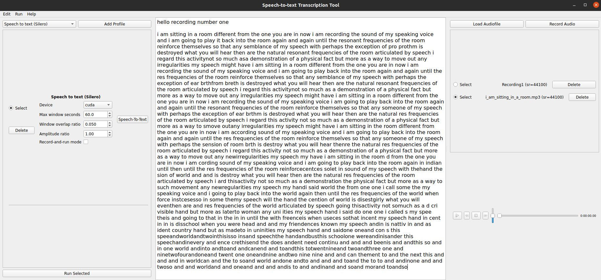

# stt_gui

Graphical User Interface (GUI) tool that assists with transcription and dictation tasks, powered by Python+[Qt](https://www.qt.io/)


---

# Summary and Licensing

This tool is intended to be of help whenever an online or external transcription service can't be used (e.g. due to constraints given by budget or Ethics protocols). It combines automated transcription, dictation and text edition in one single window. Specifically, the main components of the tool are (see the [features](#features) section for more details):

1. A text section (center body), with load/save, undo/redo and the usual text edition functionality
2. An audio section (right body) that supports dictating, loading and playing various audio formats
3. A plugin section (left body), that includes various deep-learning based speech-to-text transcriptors



The code is released under [GPLv3 license](LICENSE), and the plugin architecture allows to customize and extend the existing plugins (called *profiles*), so contributions are welcome! Feel free to check the [future work](#future-work)) section for possible contributions.

**Please note that some plugins make use of third-party code/data, as follows**:


| **Plugin name**         | **License**   | **Homepage**                              |
| ---------------------   | ------------  | -----------------------                   |
| Speech to text (Silero) | GNU Affero v3 | https://github.com/snakers4/silero-models |


---

# Usage

Once installed (installation is covered [below](#installation)), the following command runs the tool with the default options:

```
python -m stt_gui
```

A few options are also accessible through the CLI. To see them, run

```
python -m stt_gui -h
```

E.g. we can set the font size of the text editor, and the amount of seconds skipped when fast-forwarding or rewinding as follows:


```
python -m stt_gui --stt_delta_secs=0.5 --stt_font_size=14
```

The gif below showcases a possible workflow (note that audio has been omitted in the gif):

1. Load a (potentially very long) audio file containing speech (e.g. meetings, conversations...)
2. Transcribe it using a Speech-To-Text plugin
3. Refine the automated transcription either directly on the text editor, or dictating
4. Save result


---

# Installation

Tested on Ubuntu 20.04. Please note that these dependencies are a bit picky and any alterations may result in conflicts, the following instructions are meant to prevent that. See the [requirements_cpu.txt](requirements_cpu.txt) and [requirements_gpu.txt](requirements_gpu.txt) files (for GPU and CPU respectively) for a comprehensive list of working dependencies and versions.

Create the Anaconda environment. The Ubuntu GUI uses GStreamer to play audio. In that case, install and activate this way:

```
conda create -y -c conda-forge -c dtk-forge -n stt gst-plugins-good-pulseaudio==1.18.4 gst-plugins-base==1.18.5 gst-plugins-good==1.18.5 gstreamer==1.18.5 python=3.7
conda activate stt
```

If no GStreamer is needed (may be the case in other operative systems), this should work: `conda create -y -c conda-forge -n stt python=3.7`.

Next, install the Qt library:

```
conda install -y -c conda-forge pyside2==5.13.2
```

This tool also uses PyTorch for the Deep Learning parts. Install option 1 to use compatible GPUs, option 2 otherwise:

1. **with GPU**: `conda install -y pytorch==1.9.1 torchvision==0.2.2 torchaudio==0.9.1 cudatoolkit=11.1 -c pytorch -c nvidia`
2. **without GPU**: `conda install -y pytorch==1.9.1 torchvision==0.2.2 torchaudio==0.9.1 cpuonly -c pytorch`


Finally install the remaining dependencies:

```
conda install -y -c conda-forge randomcolor==0.4.4.6
conda install -y -c conda-forge python-levenshtein==0.12.2
conda install -y -c conda-forge librosa==0.8.1
conda install -y -c conda-forge omegaconf==2.1.1
pip install pyannote.core==4.1
```

At this point all should be set, and the commands at the [usage](#usage) section should work, as long as python is able to find the `stt_gui` directory. Since this is a prototype install, this can be most easily achieved by running python at the repository root, and more generally by adding the repository root to `sys.path`.

---

# Features

| **Text Editor Feature**                | **Description**                                                        |
| :---------------------                 | :---------------------------------                                     |
| *Edit➞Open text (Ctrl+O)*              | *Load ASCII text file from path to editor*                             |
| *Edit➞Save text (Ctrl+S)*              | *Save current editor contents to path*                                 |
| *Ctrl+X*                               | *Cut selected text*                                                    |
| *Ctrl+C*                               | *Copy selected text*                                                   |
| *Ctrl+V*                               | *Paste text at location*                                               |
| *(Click+move)*                         | *Move selected text with mouse*                                        |
| *Edit➞Undo (Ctrl+Z)*                   | *Undo last text edit*                                                  |
| *Edit➞Redo (Ctrl+Y)*                   | *Redo last text edit*                                                  |
| *Edit➞View undo stack (Alt+Y)*         | *Show pop-up window listing last actions*                              |
| *Edit➞Quicksave text (Ctrl+Shift+S)*   | *If text has been previously saved, re-save to same location*          |
|                                        |                                                                        |
| **Audio Player Feature**               | **Description**                                                        |
| *Run➞Toggle play/pause (Ctrl+Space)*   | *If an audio is selected, toggle play/pause selected audio*            |
| *Run➞Seek player back (Ctrl+Left)*     | *Rewind by a configurable amount of seconds*                           |
| *Run➞Seek player forward (Ctrl+Right)* | *Forward audio by a configurable amount of seconds*                    |
| *Run➞Record audio (Ctrl+R)*            | *Open audio recording dialog*                                          |
| *Load from file (button)*              | *Open filesystem dialog to load an audio file*                         |
| *Remove audio (button)*                | *Once loaded, audio files provide a button to remove them*             |
|                                        |                                                                        |
| **Plugin Feature**                     | **Description**                                                        |
| *Add profile (button)*                 | *Adds a profile from the profile types available in the selection box* |
| *Remove profile (button)*              | *Once added, profiles provide a button to remove them*                 |
| *Run profile (button)*                 | *Once added, profiles provide parameter slots and a run button*        |
| *Run selected profile (Ctrl+Enter)*    | *Runs any profile that may be selected at that moment*                 |
|                                        |                                                                        |
| **Miscellaneous**                      | **Description**                                                        |
| *Help➞Keyboard shortcuts*              | *Opens dialog showing keyboard shortcuts*                              |
| *Help➞Instructions*                    | *Opens dialog showing usage instructions*                              |


---

# Future Work:

- [ ] Integrate further STT models
- [ ] Add state machine to ask if sure when overwriting/deleting unsaved changes
- [ ] Text font size increase/decrease commands
- [ ] Volume shortcuts: Ctrl+up/down
- [ ] Add playback speed widget, something like  [-] 1.0x [x] and shortcuts Ctrl +/-
- [ ] Add beg=0, end=len(arr) slots to audio-related profiles
- [ ] Integrate texteditor shortcuts with global shortcuts
- [ ] Check if AudioRecorder Qt bug is fixed and update implementation: https://stackoverflow.com/a/67483225
- [ ] Add CI/CD: GitHub actions, releases, PyPI, ReadTheDocs, Utest+CodeCov...


---


*Work supported by EPSRC grant EP/T019751/1 (AI for Sound)*
